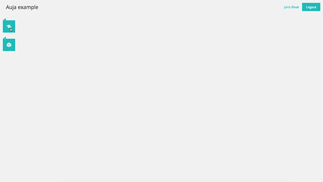

<h2 class="no-line">Implement Auja regardless of which server-side technology you use.</h2>

 Auja is a Javascript interface meant to be used together with a back-end implementation for your preferred framework, whatever server side language you use.

    

    
        
    

    

        <h4>Simple JSON contract</h4>
        
The Auja interface interactis with any application via Json. Due to strict Json contracts, the implementation of Auja on other applications is very straightforward.

    

    

        <h4>Fully responsive</h4>
        
Auja is fully responsive. The flat UI is spacious on large screens and uses less space on smaller screens. But Auja also supports mobile devices, with an alternative view for phones and other small screens.

    

    

        <h4>Advanced data input types</h4>
        
Auja supports many data input types directly out of the box. Dus to the strics Json contracts,  you can easily get your hands on these data types during developing.

    

 Start right now with using Auja for your backend implementation.

    <a href="/getting_started.html" class="button black">Start now</a>

